# Polyglot Codebase Knowledge Graph

> Generated offline by **readmenator**. Supports C, C++, Python, Go, Rust, JS/TS, Java, C#, Shell, PHP, Dart, GDScript, Nim, ASM.
> No LLMs. No tokens. Pure static analysis.

**Total Files Parsed:** 1 | **Total Symbols Extracted:** 7 | **Total Imports:** 7

## Structural Knowledge Map

```mermaid
graph TD
    classDef mod fill:#1e1e1e,stroke:#ff6666,stroke-width:2px,color:#fff;
    classDef cls fill:#2d2d2d,stroke:#4ec9b0,stroke-width:2px,color:#fff;
    classDef fn fill:#333,stroke:#dcdcaa,stroke-width:1px,color:#dcdcaa;
    classDef ext fill:#111,stroke:#666,stroke-dasharray: 5 5,color:#aaa;
    main_py["main.py (py)"]
    class main_py mod;
    main_py_insert_location["insert_location"]
    class main_py_insert_location fn;
    main_py --> main_py_insert_location
    main_py_print_table_structure["print_table_structure"]
    class main_py_print_table_structure fn;
    main_py --> main_py_print_table_structure
    main_py_print_table_data["print_table_data"]
    class main_py_print_table_data fn;
    main_py --> main_py_print_table_data
    main_py_create_database["create_database"]
    class main_py_create_database fn;
    main_py --> main_py_create_database
    main_py_get_location_data["get_location_data"]
    class main_py_get_location_data fn;
    main_py --> main_py_get_location_data
    ext_http_client["http.client"]
    class ext_http_client ext;
    main_py -.->|imports| ext_http_client
    ext_urllib_parse["urllib.parse"]
    class ext_urllib_parse ext;
    main_py -.->|imports| ext_urllib_parse
    ext_sqlite3["sqlite3"]
    class ext_sqlite3 ext;
    main_py -.->|imports| ext_sqlite3
    ext_os["os"]
    class ext_os ext;
    main_py -.->|imports| ext_os
    ext_requests["requests"]
    class ext_requests ext;
    main_py -.->|imports| ext_requests
    ext_json["json"]
    class ext_json ext;
    main_py -.->|imports| ext_json
    ext_sys["sys"]
    class ext_sys ext;
    main_py -.->|imports| ext_sys
```

---

## Architecture Reference

### PY (1 files)

#### `main.py`
**Path:** `main.py`

**Functions:**
- `insert_location` (line 10)
- `print_table_structure` (line 27)
- `print_table_data` (line 38)
- `create_database` (line 49)
- `get_location_data` (line 81)
- `get_geocoding_data` (line 91)
- `print_banner` (line 108)
